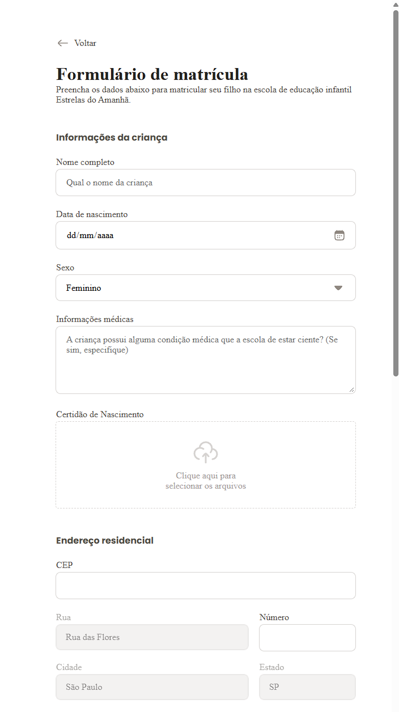

# Formulário de Matrícula

Réplica de um formulário de matrícula escolar, feito em HTML e CSS puro, sem JavaScript.

Demo: https://theusan777.github.io/formulario-de-matricula/

## Preview

<p align="center">
  
  
</p>

## Sobre o projeto

Projeto de prática de HTML e CSS focado em formulários: diferentes tipos de input (texto, data, select, radio, upload de arquivo, checkbox) organizados em seções, além de layout com ilustração e textos institucionais ao lado do formulário.

O formulário reúne dados da criança, endereço, informações do responsável e opções de matrícula (turno e esporte), mas não tem envio funcional, é só a interface.

## Tecnologias

- HTML
- CSS

## Funcionalidades

- Formulário dividido em seções: informações da criança, endereço residencial, dados do responsável e opções de matrícula
- Campo de upload para a certidão de nascimento
- Seleção de turno (manhã/tarde) e esportes via inputs estilizados
- Checkbox de aceite dos termos e condições

## Estrutura do projeto

```
index.html
assets/   (ícones, ilustração e logo)
styles/   (CSS)
```

## Como executar

git clone https://github.com/theusan777/formulario-de-matricula.git

Depois é só abrir o `index.html` no navegador, não precisa de instalação.

## Deploy

[Acessar projeto](https://theusan777.github.io/formulario-de-matricula/)

## Aprendizados

Foi um projeto pra treinar tipos de input menos comuns (file upload, radio estilizado) e organizar CSS pra um formulário mais longo, com várias seções.
